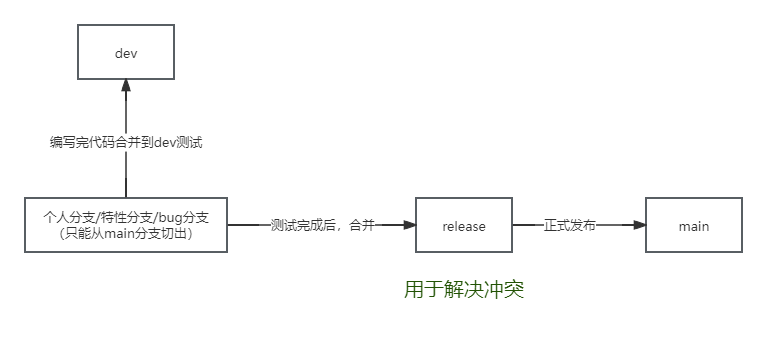

# 编码规范

## 前言

**代码是人的思想与计算机交流的工具**

**<p style='color:red;'>最终是给人看的，于人方便，于己方便。</p>**

**清晰的代码逻辑可以提高工作效率，便于维护。**
**写代码就像写诗一样，希望大家都能写出优雅的代码。**

## 目录

- [编码规范](#编码规范)
    - [前言](#前言)
    - [目录](#目录)
    - [通用规范](#通用规范)
        - [强制项](#强制项)
        - [建议项](#建议项)
    - [http接口设计规范](#http接口设计规范)
        - [响应体范例](#响应体范例)
    - [http接口URL路径规范 后端提供的接口](#http接口url路径规范-后端提供的接口)
    - [java编码规范](#java编码规范)
        - [强制项](#强制项-1)
        - [建议项](#建议项-1)
        - [类的命名规范](#类的命名规范)
    - [maven项目规范](#maven项目规范)
    - [前端规范](#前端规范)
        - [目录规范](#目录规范)
            - [模块命名](#模块命名)
            - [文件夹命名](#文件夹命名)
            - [assets目录](#assets目录)
        - [组件规范](#组件规范)
            - [组件结构化](#组件结构化)
            - [引号使用](#引号使用)
            - [组件名命名规范](#组件名命名规范)
        - [JS规范](#js规范)
            - [Function命名规范](#function命名规范)
            - [常量命名](#常量命名)
    - [MySql规范](#mysql规范)
        - [强制项](#强制项-2)
        - [建议项](#建议项-2)
    - [git管理规范](#git管理规范)
        - [版本管理规范](#版本管理规范)
        - [数据库sql脚本 版本管理](#数据库sql脚本-版本管理)
        - [强制项](#强制项-3)
        - [分支说明](#分支说明)
            - [以下是主干分支 不能提交代码 只能合并](#以下是主干分支-不能提交代码-只能合并)
        - [其他分支说明](#其他分支说明)
        - [分支发布简易流程](#分支发布简易流程)

## 通用规范

**高质量代码的判断标准**

***开发过程中要对自己有要求，有追求，可以用以下标准来审视自己的代码***

* 可维护性：在当前代码的基础上，做修正或改进，是否容易做到？
* 可扩展性：当有了新的需求，在不对当前代码做大的改动的前期下，是否容易满足？
* 可复用性：代码是否能较容易的迁移到别的地方使用？不重复造轮子。
* 可读性：当其他人阅读代码，或者过一段时间自己再阅读，是否容易理解？
* 灵活性：是否足够灵活，易调整？
* 简洁性：是否简单，不复杂？
* 可测试性：是否容易测试正确性？

### 强制项

| 条目                         | 说明/建议                                                                                                             |
|----------------------------|-------------------------------------------------------------------------------------------------------------------|
| 单个代码文件禁止超过1000行            | 业务逻辑复杂的，通过将逻辑“分层”或“分块”可以拆分成不同的文件。或者是可以使用一些设计模式                                                                    |
| 单个函数禁止超过50                 | 同上，拆分复杂的逻辑                                                                                                        |
| if、else、for、while等禁止嵌套三层以上 | 可以将嵌套的内容封装成方法，不满足条件的可以提前return或continue                                                                           |
| 变量命名禁止使用单个字母、拼音            | 尽量做到看到这个变量就能知道是干嘛用的                                                                                               |
| 禁止出现大片的注释                  | 如果想要参考老的代码，可以自己备份或者利用git查看历史版本                                                                                    |
| 要有勤写注释的习惯                  | 所有的函数以及类都应该写上注释，写注释的时候就当成是给完全不懂代码的人写的（很多时候时间长了自己也会忘记）                                                             |
| 所有文件都使用LF换行符               | LF即 \n ，而不是 \r\n ，LF格式换行是Linux的默认模式，也是git的默认模式。[设置方式](https://blog.csdn.net/sdujava2011/article/details/83827343) |
| 所有文件都使用LF换行符               | [git设置方法](https://www.cnblogs.com/youpeng/p/11243871.html)                                                        |

### 建议项

* 统一文件字符集，使用utf-8
* 统一缩进格式，使用4个空格
* 一个项目里，目录结构、命名规范等应该是一致的
* 编写完代码都需要进行格式化，相同的语言所使用的编码工具应保持一致（代码格式化工具需要保持一致）
* 关联性不强 的代码 建议空行隔开
* 对接第三方系统的接口
    * 如果第三方系统没有提供sdk，那么就需要自己封装一层，建议每个系统封装一个类
    * 在自己的业务层逻辑里去调用这个类，不要在自己的service层直接发起对第三方系统接口的调用
    * 入参、出参，封装好对应的实体类
    * 以上做法的好处是，逻辑是分层的，每一层逻辑都会比较清晰，易维护、易扩展

## http接口设计规范

**为降低前后端http接口对接过程中的沟通成本，建议如下**

**以下标准，可以排除一些特殊情况，例如文件的上传和下载**

* 请求体参数统一使用utf-8编码的json
* 响应体参数统一使用utf-8编码的json，并且同一个项目中响应参数格式大体上要保持一致，即json的第一层字段保持一致。
* 响应体参数按需返回，提前与前端沟通。数据库实体，不能直接返回，需要封装。
* HTTP
  响应状态码，不要出现非200的情况，在一些特殊状态码下前端不容易处理。[HTTP 响应状态码 定义](https://developer.mozilla.org/zh-CN/docs/Web/HTTP/Status)

### 响应体范例

**仅作为参考**

| 字段      | 类型      | 必填 | 说明                                     |
|---------|---------|----|----------------------------------------|
| code    | int     | 是  | 状态码，200为操作成功。这里做简化处理，单个接口不同情况的状态码不一致即可 |
| message | int     | 是  | 消息，对code进行解释                           |
| success | boolean | 是  | 操作是否成功                                 |
| data    | any     | 否  | 每个接口返回的具体的信息，null时可以不返回                |

**json示例**

```json
{
  "success": true,
  "code": 200,
  "message": "操作成功",
  "data": null
}
```

## http接口URL路径规范 后端提供的接口

**[关于URL的定义](https://developer.mozilla.org/zh-CN/docs/Learn/Common_questions/Web_mechanics/What_is_a_URL)**

* 全部小写,单词之间用"-"分隔

    * 有以下方面的考虑

    1. 百度搜索引擎会将"-"（减号 或称为 连字符）和"_"（下划线）当成空格处理，例如"user-list",会当成"user"和"list两个单词"
    2. 谷歌搜索引擎只会对"-"做处理，以上基于seo优化的考虑
    3. IE浏览器如果域名中出现"_"（下划线），程序将不能读写Cookie，因此不建议用下划线
    4. 路径部分，大小是否敏感不同的服务端会有不同的处理，因此这里统一规范，只用小写

* "/"分隔的层级不要超过三层，建议：/模块/方法名、/系统/子模块/方法名、/模块/控制器/方法

## java编码规范

### 强制项

| 条目                       | 说明/建议                                                                                                                                            |
|--------------------------|--------------------------------------------------------------------------------------------------------------------------------------------------|
| 统一引用注入容器的实例的方式           | 统一使用 @RequiredArgsConstructor 注解或者自己写构造函数<br>成员变量声明为 "private final"<br>[为什么Spring不推荐使用@Autowired注解](https://juejin.cn/post/7024382744742494216) |
| 所有的覆写方法，必须加 @Override注解  |                                                                                                                                                  |
| 所有的泛型实例化的时候，要指明类型参数      |                                                                                                                                                  |
| 配置文件统一使用yaml格式           | yaml是结构化的数据，可读性高。properties可读性不高，特别是配置数据、对象之类的前缀重复，配置麻烦。                                                                                         |
| 不允许直接带条件删除数据库中的记录        | 需要先查后删                                                                                                                                           |
| 数据库实体类需要注明 表名            | 使用@TableName注解 或 注释                                                                                                                              |
| sql语句不能超过20行             | 建议关联子查询建议在代码的逻辑层解决                                                                                                                               |
| 注释要符合javadoc的标准          | 如果是编写公共的jar包，那么就可以生成javadoc并发布                                                                                                                   |
| 新建参数、更新参数，定义为两个类，不要用分组校验 |                                                                                                                                                  |

### 建议项

* 方法链式调用时"."前面加换行 一行即一个方法调用
* 在使用idea编写代码的时候也有很多提示（包含一些编码规范），请大家多注意提示信息，尽量使用新版的idea
* 减少使用hutool进行bean到bean的直接转换，防止某个bean的字段修改忘记修改另一个的情况。或者是强制保持字段名相同。

### 类的命名规范

**大写字母开头驼峰式命名，不允许出现数字和特殊字符**
***原则：看见类的名字就能知道是干嘛的。同一个项目类的命名规范应该一致***

**以下仅供参考**

| 条目            | 示例               | 说明                                                             |
|---------------|------------------|----------------------------------------------------------------|
| 数据库表的实体类      | XxxEntity        | 在使用mybatis-plus的情况下，使用@TableName注解表名，即Mapper接口继承了BaseMapper的时候 |
| 请求参数          | XxxRequest       |                                                                |
| 响应参数          | XxxResponse      | 很多地方都是使用VO对象，但是不够直观                                            |
| 数据传递实体        | XxxDto           | 可用于微服务之间调用                                                     |
| 配置项           | XxxProperties    | 用@ConfigurationProperties注解的类                                  |
| 配置类           | XxxConfiguration | 用@Configuration注解生成bean的类                                      |
| 枚举            | XxxEnum          |                                                                |
| 启动类           | XxxRunner        | 例如实现了CommandLineRunner的类                                       |
| 任务类           | XxxTask          |                                                                |
| Repository层接口 | XxxRepository    |                                                                |
| service层接口    | XxxService       |                                                                |
| service层接口实现类 | XxxServiceImpl   |                                                                |
| 工具类           | XxxUtil          |                                                                |

## maven项目规范

* 包名规范

| 条目         | 说明/建议                                                               |
|------------|---------------------------------------------------------------------|
| groupId    | 命名规则：com.hclm.xxx,其中xxx为项目英文名，全部小写,xxx可以省略                          |
| artifactId | 以模块名命名,单模块项目也可以是与上面的xxx相同，英文小写，多个单词用“-”分割                           |
| java包名     | 基础包名规则：com.hclm.xxx.yyy 或 com.hclm.yyy ，xxx为项目名，yyy为模块名，x与y相同时则省略一个 |

## 前端规范

### 目录规范

#### 模块命名

* 采用kebab-case命名方式，多个noun单词用短横线"-"分割
* 一般不超过2个单词，采用模块-子模块方式，这样module会按模块级别归类排序

```ts
// bad
compilerCore
compilerDom
compilerSSR

//good
compiler - core
compiler - dom
compiler - ssr
```

#### 文件夹命名

* 采用kebab-case规则，以noun单词命名
* 同类功能的文件夹，一般以复数结尾

```ts
//good
components
hooks
utils
scripts
directives
```

#### assets目录

```ts
-assets
- images
- icons
- styles
- svgs
```

### 组件规范

#### 组件结构化

* 文件结构按script、template、style顺序布局
* vscode --> 设置 --> 配置用户代码片段 --> 新建全局代码片段文件(vue.json)

```json
{
  "vue3": {
    "prefix": "vue3",
    "body": [
      "<script setup lang=\"ts\">",
      "import { ref, reactive } from \"vue\"",
      "",
      "/** props **/",
      "",
      "",
      "/** emits **/",
      "",
      "",
      "/** refs **/",
      "",
      "",
      "/** computed **/",
      "",
      "",
      "/** methods **/",
      "",
      "",
      "</script>",
      "<template>",
      "<div>",
      "",
      "",
      "</div>",
      "</template>",
      "<style lang=\"sass\" scoped>",
      "",
      "",
      "",
      "",
      "</style>",
      ""
    ]
  }
}
```

#### 引号使用

* vue的template标签属性使用双引号
* js中的字符串使用单引号
* js代码行统一不用分号
* 配置prettier自动格式化

```json

```

#### 组件名命名规范

* 采用kebab-case命名
* 组件名一般不超过3个单词

```ts
// 高优先单词开头，描述性单词结尾
components
- search - button.vue
- search - button - clear.vue
- search - input.vue
- search - input.query.vue

// 父组件紧密相关的子组件应该以父组件作为前缀命名
components
- todo - list.vue
- todo - list - item.vue

// 组件名使用完整单词
components  // bad
- SdSettings.vue
- UProfOpts.vue

components  // good
- student - dashboard - settings.vue
- user - profile - options.vue

```

### JS规范

#### Function命名规范

* 业务方法，使用lowerCamelCase小驼峰
* 事件方法

```ts
// 事件方法命名，通常采用 on + Verb + Noun? 形式
onClick, onClose, onConfirm

// 逻辑处理类命名，通常采用 handle + Noun + Verb
handleIconCLick, handleChange, handleSelect

// 请求接口类方法命名
get请求：get + Noun + Data
post请求： post + Noun + Data
update请求：update + Noun + Data
delete请求：delete +Noun + Data
```

#### 常量命名

* 统一放入constants.ts文件
* 常量名使用大写字母+下划线

```ts
export const DAYS_IN_WEEK = 7
export const MONTHS_IN_YEAR = 12
export const MAX_DOG_WEIGHT = 150
```

## MySql规范

### 强制项

* 所有表都要有自增主键，主键命名为"xxx_id",其他表关联该表时字段名为"xxx_id",其中xxx可以是表名(对象名)
* 字段命名，单词之间以"_"间隔，全部小写
* 不得使用外键，一切外键概念必须在应用层解决。
* 每个字段和表必须提供清晰的注释
* 数据库统一使用 utf8mb4 编码

### 建议项

* 尽量不使用连表查询
* 关键信息的表可以增加以下通用字段：

| 字段          | 类型                   | 说明   |
|-------------|----------------------|------|
| create_by   | varchar(64) NOT NULL | 创建者  |
| create_time | datetime NOT NULL    | 创建时间 |
| update_by   | varchar(64) NOT NULL | 更新者  |
| update_time | datetime NOT NULL    | 更新时间 |

## git管理规范

### 版本管理规范

* 待完善

### 数据库sql脚本 版本管理

* 待完善

### 强制项

| 条目                            | 说明/建议                                                                                          |
|-------------------------------|------------------------------------------------------------------------------------------------|
| 项目中必须存在README.md文件            | README.md即项目的自诉文件，在gitlab、github、gitee等平台上会自动显示<br>每个项目需要写明该项目的目录结构（都有哪些模块）、主要用途、所使用的主要技术等关键信息 |
| 成熟框架自动生成的README.md文件，必须进行修改完善 | 同上，主要目的是描述清楚该项目利用哪些技术完成了哪些功能需求，让开发者能大致了解该项目                                                    |
| 项目中必须存在".gitignore"文件         | 统一git忽略文件的标准，防止无用文件的提交,可参考本项目的.gitignore                                                       |

### 分支说明

* git高版本默认分支名就是main，这里不再使用master

#### 以下是主干分支 不能提交代码 只能合并

| 分支      | 说明                                                                   |
|---------|----------------------------------------------------------------------|
| main    | 主分支，用于生产环境。<span style='color:red;'>自己用来自测的、写着玩的代码不要出现在这个分支里。</span> |
| release | 预发布分支，较为稳定的分支。主要用于合并冲突。                                              |
| dev     | 开发测试分支，用于发布到测试环境                                                     |

### 其他分支说明

| 分支   | 说明                                        |
|------|-------------------------------------------|
| 个人分支 | 以每个人的名字命名                                 |
| 特性分支 | 以开发功能的名称命名，多个人同时开发一个功能时使用，开发并发布后，需要及时删除   |
| bug  | 命名规则：xxx-bug,其中xxx为修复的bug名称，开发并发布后，需要及时删除 |

### 分支发布简易流程

**因为目前只有测试环境，因此代码发布较为简单**


